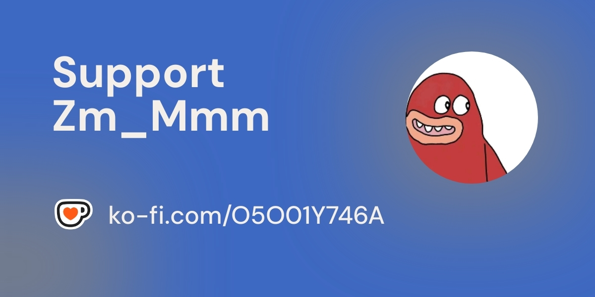

<div align="center">

[**中文**](README.zh.md) · English

# Kilacraft-AI

**The first plugin that gives every server an AI agent that understands you better the more you use it**

[](https://github.com/Zm-Mmm/Kilacraft-AI/wiki/Changelog)
[](LICENSE)
[](https://discord.gg/nNmhcZHDxr)
[](https://github.com/axy-yxa/Kilacraft-AI)

</div>

---

## Features

| | Feature | Description |
|:---:|:---|:---|
| 🤖 | **AI Engine** | LLM intent recognition · Multi-step task planning & execution · RAG knowledge base · Embedding semantic search · 5 output carriers · Streaming output · Secondary analysis coordinator · Public broadcast · Response sound effects |
| 🧠 | **Player Profile** | 5-dimension behavioral analysis (style/personality/preferences/communication/observations) · Auto-analysis from conversations · Incremental cumulative updates · Version tracking · Historical snapshots · Dynamic prompt injection · AI gets smarter about each player |
| 🕸️ | **Social Relations** | Auto-track private messages/TPA/skill interactions · Diminishing incremental strength · Daily decay · Friend milestone cross-promotion |
| 👋 | **Smart Greetings** | Personalized login greetings · Three-category aggregation (own events/friend dynamics/session highlights) · Profile-aware · First-time/returning dual mode |
| 💾 | **Data Persistence** | Conversation history · Player profiles · Social graph · Server events · Skill audit · Profile snapshots · H2 zero-config / MySQL hot-swap · Group server data isolation |
| 💰 | **Economy** | GlobalMarketPlus integration · Natural language balance/price/listing queries · AI-powered trading (sell/buy/transfer/auction) · Multi-item search |
| 🔍 | **Bukkit API** | 72 built-in read-only APIs · YAML data-driven · Multi-step data passing (with array indexing) · Fine-grained permissions |
| 🎮 | **CMI Integration** | Teleport (home/warp/TPA) · Enhanced player info (playtime/AFK/vanish/armor/online list) |
| 🔔 | **AFK Tasks** | 20 types (19 event listeners + CUSTOM polling) · Natural language creation · Notification/callback dual mode · Smart callback |
| 📊 | **Vanilla Stats** | 80+ vanilla statistics query · Knowledge base BM25 retrieval · Distance/time auto-conversion · Multi-step condition monitoring |
| 🎭 | **Personalization** | Multi-personality system · RAG knowledge enhancement (HanLP + BM25) · Embedding semantic search · Custom dictionary · Full language config |
| 🔧 | **Command Execution** | Execute commands as player · Full server permission inheritance · Config toggle + permission node |
| 🎨 | **Sound & Particles** | AI-triggered sounds/particles · Only caller perceives · YAML-driven config |
| 🔌 | **SPI Extension** | Third-party Skill registration · Plugin command mode · Complete dev docs · Global Skill registry |
| 🛡️ | **Security** | Non-cooperative value scanning filter · Cross-player ops blocked unless whitelisted · Malicious Skills cannot bypass · Skill permission pre-filter |

## Quick Start

**1.** Download [Kilacraft-AI-2.0.2.jar](https://github.com/Zm-Mmm/Kilacraft-AI/releases) and place it in `plugins/`

**2.** Edit `plugins/Kilacraft-AI/llm.yml` with your API key:

```yaml
llm:
  api_url: "https://api.deepseek.com/v1/chat/completions"
  api_key: "your-api-key"
  model: "deepseek-chat"
```

**3.** Restart the server, then test with `/kila Hello`

> Supports all OpenAI-compatible APIs (DeepSeek / Zhipu AI / Moonshot etc.). Just change `api_url` and `model`.

## Examples

```
Player: How much is diamond?
  AI: Diamond current price: $100.00/item (15 in stock)

Player: Check diamond price, see if I can afford 10
  AI: Diamond: $80.00/item, Balance: $12,580 → 10 costs $800, sufficient funds!

Player: Watch for Steve to come online
  AI: Monitoring task created.
  🔔 Steve is online!

Player: Alert me when my health drops below 5
  AI: Monitoring task created.
  🔔 Your health has dropped to 4.0!
```

## Compatibility

| Minecraft | Java | Server | Status |
|---|---|---|---|
| 1.16.5 | 17+ | Paper/Purpur/Leaf/Folia | ⚠️ Requires `-DPaper.IgnoreJavaVersion=true` |
| 1.17 - 1.19 | 17+ | All major cores | ✅ |
| 1.20 - 1.21+ | 21+ | All major cores | ✅ |

> Optional dependencies: MythicMobs 5.12+ (NPC placeholders) · GlobalMarketPlus 1.3.8+ (economy) · CMI (teleport/query) · Vault (multi-currency)
> Features auto-disable when plugins are missing — core chat remains unaffected.

## Commands

| Command | Permission | Description |
|---|---|---|
| `/kila <message>` | None | Chat with AI (`/kilacraft`, `/ai`, `/zm` all work) |
| `/kilacraft chat` | None | Toggle continuous chat mode |
| `/kilacraft clear [player]` | `clear.self` / `clear.other` | Clear chat history |
| `/kilacraft reload` | OP | Reload config and language files |
| `/kilacraft knowledge reload` | OP | Reload knowledge base |
| `/kilacraft personalities reload` | OP | Reload personality config |
| `/kilacraft afk [cancel]` | None | View/cancel AFK tasks |
| `/kilacraft tasks` | `kilacraft.tasks` | View scheduled task status (default OP) |
| `/kilacraft plugins <personality> <message> <UUID> [callback]` | Console | Third-party plugin integration |

## Documentation

| Document | Description |
|---|---|
| [Server Owner Guide](https://github.com/Zm-Mmm/Kilacraft-AI/wiki/Server-Owner-Guide) | Complete setup & troubleshooting |
| [Changelog](https://github.com/Zm-Mmm/Kilacraft-AI/wiki/Changelog) | Version history |
| [Bukkit API Reference](https://github.com/Zm-Mmm/Kilacraft-AI/wiki/Bukkit-API-Reference) | 72 API details |
| [AFK Task Guide](https://github.com/Zm-Mmm/Kilacraft-AI/wiki/AFK-Task-System-Guide) | AFK task system architecture |
| [Personality Guide](https://github.com/Zm-Mmm/Kilacraft-AI/wiki/Personality-System-Guide) | AI persona management |
| [Knowledge Base Guide](https://github.com/Zm-Mmm/Kilacraft-AI/wiki/Knowledge-Base-Guide) | RAG knowledge base config |
| [Skill SPI Doc](https://github.com/Zm-Mmm/Kilacraft-AI/wiki/Skill-SPI-Integration-Guide) | Third-party Skill development |
| [Skill Global Registry](https://axy-yxa.github.io/Kilacraft-AI/skill-registry.html) | Real-time Skill usage stats & security review |

## Developers

- **Building** requires JDK 21+ (MythicMobs 5.12+ dependency), output JAR runs on Java 17+
- Third-party plugins can register custom Skills via **Skill SPI** → [Integration Guide](https://github.com/Zm-Mmm/Kilacraft-AI/wiki/Skill-SPI-Integration-Guide)
- Contributions welcome via [Issues](https://github.com/axy-yxa/Kilacraft-AI/issues) / Pull Requests

## Submit Skill for Review

Want your Skill to be whitelisted in the global registry? After review, users will see 🟢 Verified badge on the [Skill Global Registry](https://axy-yxa.github.io/Kilacraft-AI/skill-registry.html).

**How to submit**: Create a new [Issue](https://github.com/axy-yxa/Kilacraft-AI/issues) with title `[Skill Review] Your Skill Name`

**Required information:**
1. **Skill name** (must match registration)
2. **Source code or JAR** (required for security review)
3. **Description** (brief explanation of what the Skill does)
4. **Permissions** (Bukkit permissions needed or plugin dependencies)
5. **Documentation** (optional, if you have usage docs or Wiki)

**Review criteria:**
- ✅ Does not manipulate other players' data (unless explicitly stated and justified)
- ✅ Does not execute dangerous commands (op-level commands, file I/O, etc.)
- ✅ No malicious network requests or data exfiltration
- ✅ Proper resource cleanup (no memory leaks)

Once approved, I'll add your Skill to the whitelist and mark it as 🟢 Verified on the registry page.

---

<div align="center">

This project is fully open-source and free. Sponsorship is purely voluntary. Your support keeps me motivated ❤️

**🎁 Sponsor perks:** 💬 Exclusive Discord channel · 🎫 Priority support · 🚀 Early access to new versions

<a href="https://ko-fi.com/zmmmm"></a>

<a href="https://ko-fi.com/zmmmm"></a>

*Please keep your payment screenshot after sponsoring, then contact me on Discord to activate your perks*

</div>

---

<div align="center">

MIT License · Made by [Zm_Mmm](https://github.com/axy-yxa) · <a href="https://discord.gg/nNmhcZHDxr"></a>

Custom development / Server-specific optimization · [Discord](https://discord.gg/nNmhcZHDxr)

</div>
